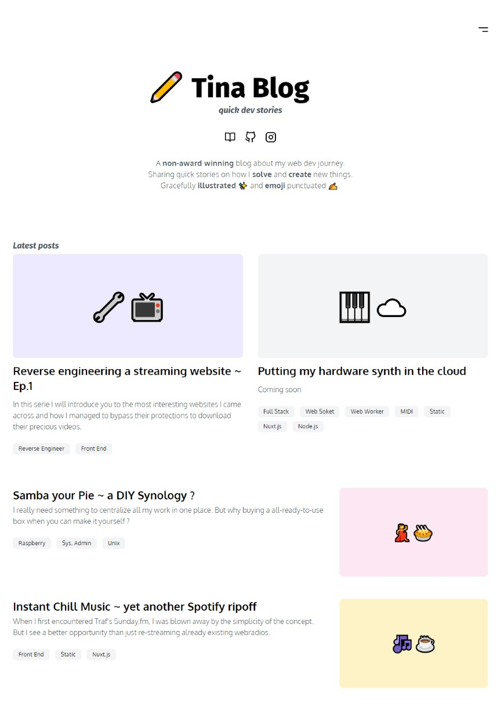

<p align="center">
    
    <br/>
    <br/>
    
    
    
</p>

<p align="center">
    
    <br/>
    <br/>
</p>

# Infos

It starts with me playing around with headless CMS. And it ends with me having now a blog ✨

All blog posts are ***Markdown*** files with a ***Front Matter*** block. These files a then *'convert'* to html files using ***Nuxt Content module***. This enables cool features such as automatic retrieval of the latest posts on the landing page or gobal style and layout.

Good Reading 💖

# Live

### 🔗 ***[blog.tina.cafe](http://blog.tina.cafe/)***
Served using *[Yeetify 💨](https://github.com/tinawng/yeetify)*

# Stack

### Nuxt.js
- ⚡️ Static website generation
### Nuxt Content module
- 📄 Git-based Headless CMS
### Tailwind
- 💄 Responsive design
- 🎨 PurgeCSS

# Links

- 🏗️ Nuxt.js: *[https://nuxtjs.org](https://nuxtjs.org/)*
- 📄 Nuxt Content: *[https://content.nuxtjs.org/](https://content.nuxtjs.org/)*
- ✨ Vue.js: *[https://vuejs.org](https://vuejs.org/)*
- 💄 Tailwind CSS: *[https://tailwindcss.com](https://tailwindcss.com/)*

# Build Process

```bash
# install dependencies
$ yarn install

# dev server with hot reload
$ yarn run dev

# build for production
$ yarn run generate
```